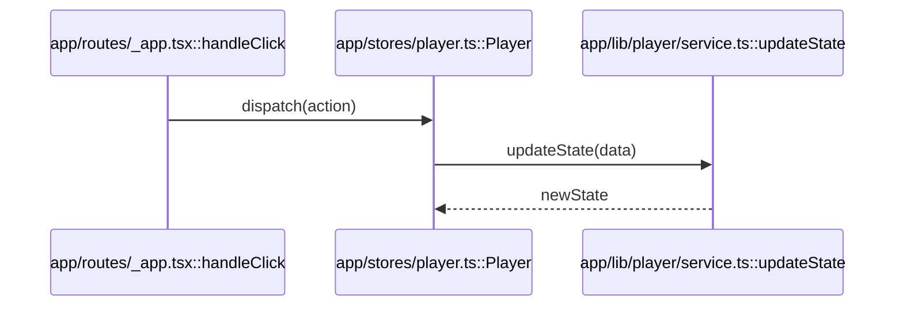

# Code Investigator

Systematically investigate code to understand specifications and provide evidence-based reports with file/line references. Saves findings to persistent memory for future reference.

## Core Capabilities

1. **Evidence-based specification confirmation**: Trace code to confirm actual behavior with file/line references
2. **Visual flow documentation**: Generate Mermaid diagrams for multi-file/complex flows
3. **Persistent memory storage**: Save investigation results in searchable format for future use
4. **Uncertainty tracking**: Clearly distinguish confirmed facts from unknowns

## Investigation Workflow

### Step 0: Plan (Brief)
State what to investigate and where to start (1-3 lines). Prevents scope drift.

### Step 1: Identify Entry Point
Locate the starting point: routing, CLI entry, UI event, main function, service initialization, etc.

### Step 2: Trace Call Chain (Shortest Path Only)
Follow function/class/module calls related to the specification. Identify:
- Data structures (DTO/Model/State) and transformation points
- Conditional logic, defaults, exception handling, retries, caching, persistence

### Step 3: Extract Confirmed Specifications
Document facts that can be determined from code:
- "When/If [condition] then [action]"
- Default values, timeout settings, retry counts, etc.

### Step 4: Handle Uncertainties
List runtime dependencies (env vars, config files, external APIs) that cannot be confirmed from code alone:
- Mark as **"Unconfirmed"**
- Suggest additional investigation methods

### Step 5: Generate Diagram (Conditional)
Create Mermaid diagram when:
- 3+ files are involved
- Async/event-driven/state transitions are present
- Dependency direction is unclear (DI, plugins, hooks)

## Output Format

Use this template for all investigation reports:

### Report Template

```markdown
## TL;DR
[1-2 sentence conclusion]

## Confirmed Specifications
[Bulleted list, each with evidence]

- **Spec**: [When/If/Then format]
  - **Evidence**: [path/to/file.ts:L10-L42](path/to/file.ts#L10-L42) - [Why this code proves the spec]
  - **Notes**: [Optional: exceptions, config dependencies, related locations]

## Implementation Evidence
[Key implementation details by file]

### [path/to/file.ts](path/to/file.ts)
- Lines X-Y: [What this code does]
- Lines A-B: [What this code does]

## Flow Diagram (Optional)
[Mermaid diagram if applicable]

## Open Questions / Unknowns
[What could not be confirmed and why]
- [Unconfirmed item]: [What additional investigation is needed]
```

### Evidence Linking Rules
- Always link files with markdown: `[path/to/file.ts](path/to/file.ts#L10-L42)`
- Use line numbers when available: `#L10-L42`
- If line numbers unavailable, use: `#functionName` or just `(file.ts)`

### Specification Item Format
Every specification MUST follow this structure:
- **Spec**: Specification statement (prefer When/If/Then format)
- **Evidence**: File reference + one-line justification
- **Notes** (optional): Exceptions, config dependencies, related code

## Diagram Guidelines

Use appropriate diagram types:
- **Process flow**: `sequenceDiagram`
- **Module dependencies**: `flowchart LR`
- **State transitions**: `stateDiagram-v2`

Diagram policy:
- Show **shortest path only** (no comprehensive views)
- Use `File::Symbol` format for node names (e.g., `src/foo.ts::createPlayer`)

Example:


## Memory Storage

All confirmed investigations are saved to: `.claude/skills/code-investigator/memories/`

### Storage Timing
- Save when specification is confirmed (even partial)
- Save incomplete results with status `in-progress`

### File Naming Convention
`YYYY-MM-DD__topic__short-slug.md`

Example: `2026-01-08__player__loop-behavior.md`

### Memory File Format
```markdown
---
summary: "Brief description of investigation topic and findings"
created: YYYY-MM-DD
updated: YYYY-MM-DD  # optional
status: confirmed | in-progress | blocked  # optional
tags: [feature-area, component]  # optional
related: [path/to/file.ts, path/to/other.ts]  # optional
---

# [Investigation Topic]

## Question
[Original user question or investigation goal]

## Confirmed Specifications
[Same format as report above]

## Implementation Evidence
[Same format as report above]

## Flow Diagram
[Mermaid if applicable]

## Open Questions
[Unconfirmed items and next steps]
```

**Language**: All memory files MUST be written in **English** (per project standards). Chat responses can be in Japanese.

## Memory Search Workflow

When asked to recall previous investigations:

```bash
# 1. List investigations
ls .claude/skills/code-investigator/memories/

# 2. View all summaries
rg "^summary:" .claude/skills/code-investigator/memories/ --no-ignore --hidden

# 3. Search summaries by keyword
rg "^summary:.*keyword" .claude/skills/code-investigator/memories/ --no-ignore --hidden -i

# 4. Search by tag
rg "^tags:.*keyword" .claude/skills/code-investigator/memories/ --no-ignore --hidden -i

# 5. Full-text search (when summary insufficient)
rg "keyword" .claude/skills/code-investigator/memories/ --no-ignore --hidden -i

# 6. Read specific memory if relevant
```

**Note**: Memory files are gitignored, use `--no-ignore --hidden` flags.

## Quality Standards

### Prohibited
- **No speculation as fact**: Use "likely" / "probably" only in "Open Questions", never in "Confirmed Specifications"
- **No baseless evidence**: Every specification claim must have file:line reference

### Required
- **Primary vs supplementary evidence**: When multiple locations support one spec, separate "primary" and "supplementary" evidence
- **Config/env dependencies**: Always note when behavior depends on ENV vars, config files, or runtime values

## References

For detailed guidance on specific patterns, see:
- [references/report-templates.md](references/report-templates.md) - Detailed report format examples
- [references/diagram-patterns.md](references/diagram-patterns.md) - Mermaid diagram examples for common scenarios

### scripts/
Executable code (Python/Bash/etc.) that can be run directly to perform specific operations.

**Examples from other skills:**
- PDF skill: `fill_fillable_fields.py`, `extract_form_field_info.py` - utilities for PDF manipulation
- DOCX skill: `document.py`, `utilities.py` - Python modules for document processing

**Appropriate for:** Python scripts, shell scripts, or any executable code that performs automation, data processing, or specific operations.

**Note:** Scripts may be executed without loading into context, but can still be read by Codex for patching or environment adjustments.

### references/
Documentation and reference material intended to be loaded into context to inform Codex's process and thinking.

**Examples from other skills:**
- Product management: `communication.md`, `context_building.md` - detailed workflow guides
- BigQuery: API reference documentation and query examples
- Finance: Schema documentation, company policies

**Appropriate for:** In-depth documentation, API references, database schemas, comprehensive guides, or any detailed information that Codex should reference while working.

### assets/
Files not intended to be loaded into context, but rather used within the output Codex produces.

**Examples from other skills:**
- Brand styling: PowerPoint template files (.pptx), logo files
- Frontend builder: HTML/React boilerplate project directories
- Typography: Font files (.ttf, .woff2)

**Appropriate for:** Templates, boilerplate code, document templates, images, icons, fonts, or any files meant to be copied or used in the final output.

---

**Not every skill requires all three types of resources.**
