# Diagram Patterns

Mermaid diagram examples for common code investigation scenarios.

## Table of Contents
- [When to Use Each Diagram Type](#when-to-use-each-diagram-type)
- [Sequence Diagrams (Process Flow)](#sequence-diagrams-process-flow)
- [Flowcharts (Module Dependencies)](#flowcharts-module-dependencies)
- [State Diagrams (State Transitions)](#state-diagrams-state-transitions)
- [Class Diagrams (Rare Use)](#class-diagrams-rare-use)

## When to Use Each Diagram Type

| Scenario | Diagram Type | Reason |
|----------|--------------|--------|
| API request → response flow | `sequenceDiagram` | Shows temporal order and message passing |
| Data transformation pipeline | `sequenceDiagram` | Shows step-by-step processing |
| Module import/dependency structure | `flowchart LR` | Shows static relationships |
| Component composition | `flowchart TD` | Shows parent-child hierarchy |
| State machine (player, form, etc.) | `stateDiagram-v2` | Shows state transitions and triggers |
| Lifecycle (mount → update → unmount) | `stateDiagram-v2` | Shows state progression over time |

## Sequence Diagrams (Process Flow)

Use for: API calls, event handlers, data flow through functions/services

### Example 1: Authentication Flow

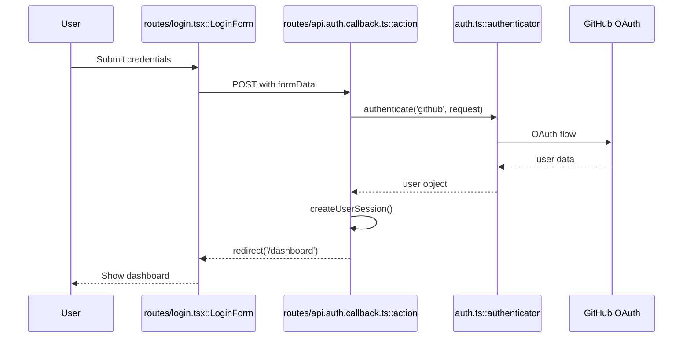

**Key points:**
- Participants use `File::Symbol` format
- Use `-->>` for responses/returns
- Use `Note` for important details

### Example 2: Data Sync Flow

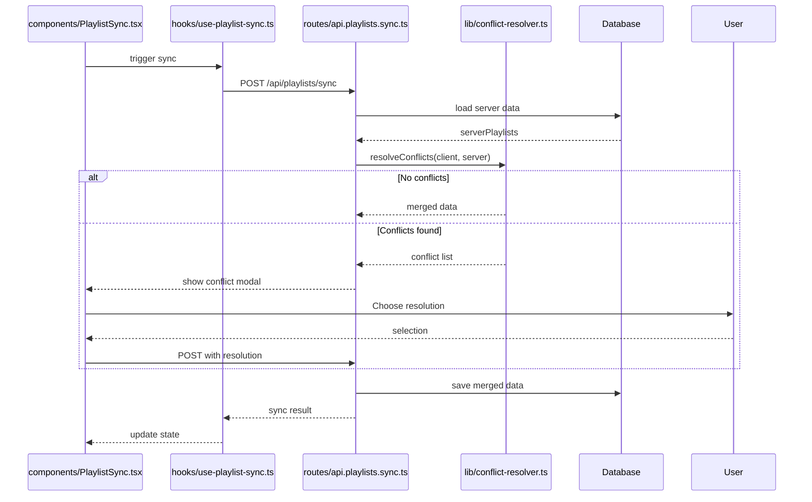

**Key points:**
- Use `alt/else` for conditional logic
- Show error/conflict paths
- Keep happy path prominent

## Flowcharts (Module Dependencies)

Use for: Import relationships, data structure flow, component hierarchy

### Example 1: Module Dependency Chain

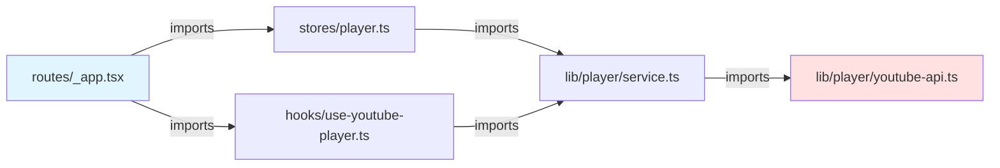

**Key points:**
- Use `LR` (left-right) for dependency chains
- Use `TD` (top-down) for hierarchies
- Color entry points and external deps differently

### Example 2: Data Transformation Pipeline

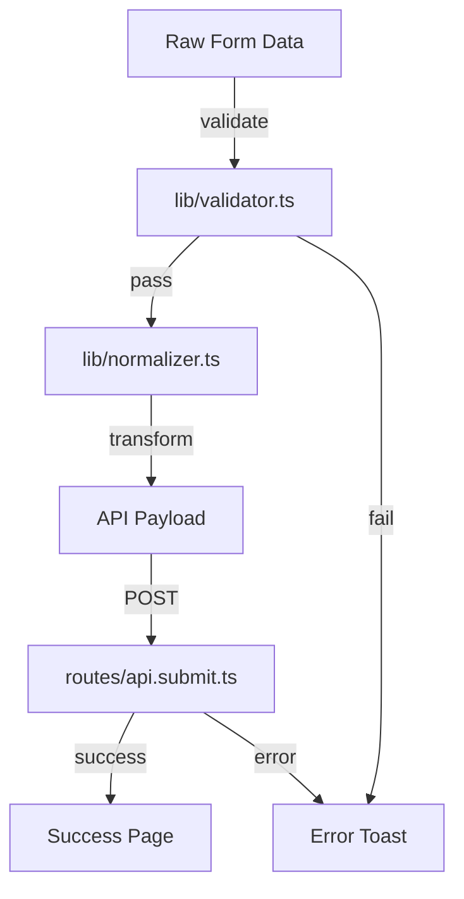

**Key points:**
- Label edges with action verbs
- Show both success and error paths
- Use `TD` for vertical flow

### Example 3: Component Composition

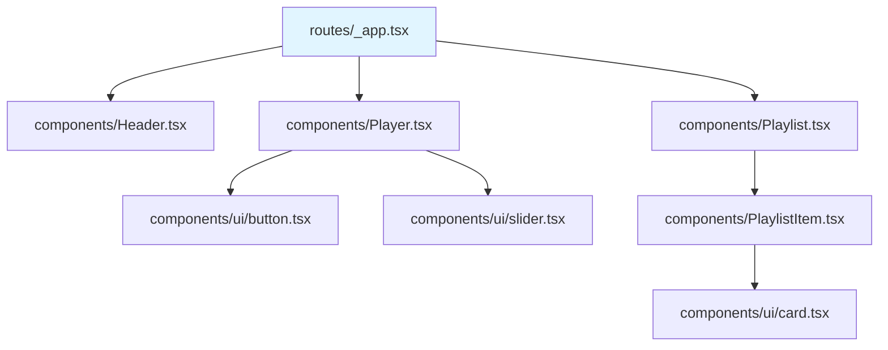

**Key points:**
- Shows parent-child component structure
- Helps understand render tree
- Useful for prop-drilling investigation

## State Diagrams (State Transitions)

Use for: State machines, lifecycle, status workflows

### Example 1: Player State Machine

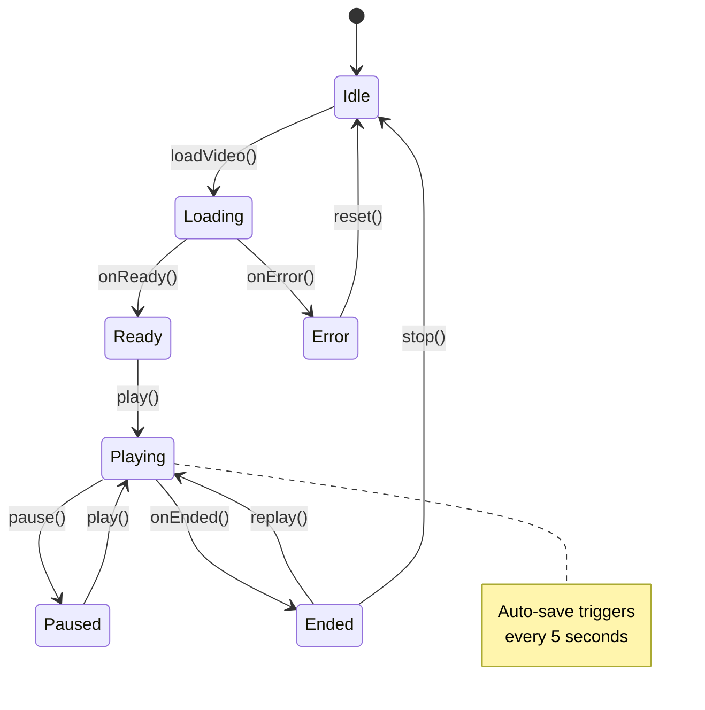

**Key points:**
- Show all possible transitions
- Label transitions with trigger methods/events
- Use notes for side effects

### Example 2: Form Validation Lifecycle

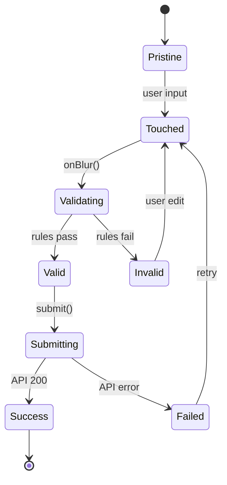

**Key points:**
- Shows form lifecycle clearly
- Includes validation and submission states
- Shows retry paths

### Example 3: Data Sync Status

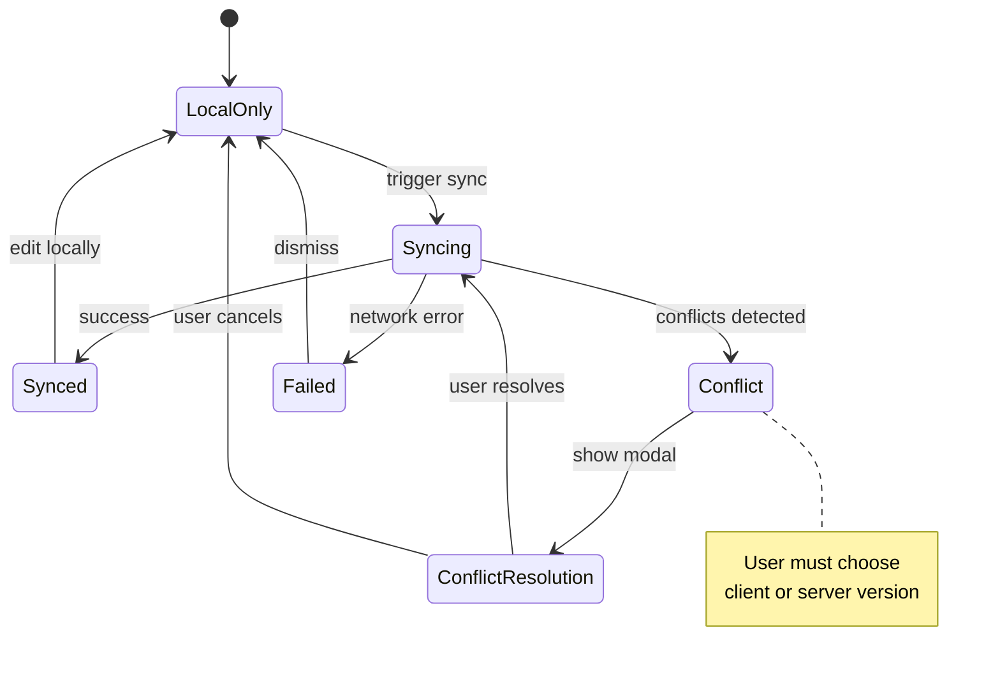

## Class Diagrams (Rare Use)

⚠️ **Use sparingly** - Only for complex OOP class hierarchies. Most modern code uses functional patterns where class diagrams add little value.

### Example: When class diagram is useful

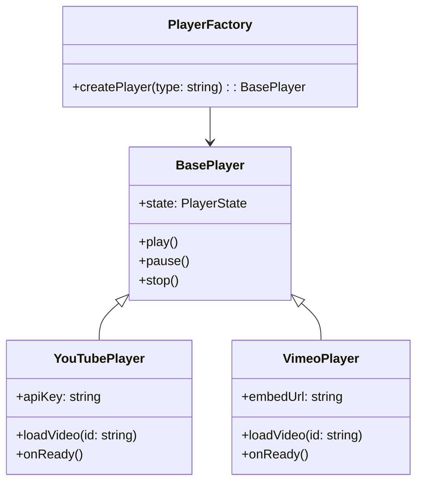

**When to use:**
- Clear inheritance hierarchies
- Factory/strategy patterns
- Interface implementations

**When NOT to use:**
- Functional components (use flowchart instead)
- Simple object structures (describe in text)
- Module systems (use flowchart instead)

## Diagram Best Practices

### Keep It Minimal
❌ **Too detailed:**
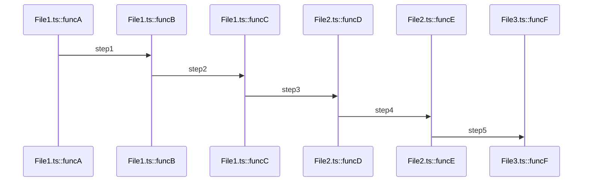

✅ **Focused on key path:**
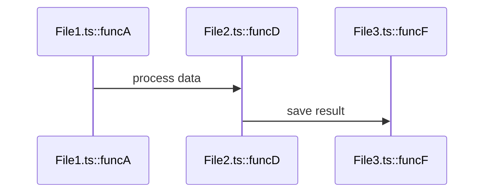

### Use Descriptive Participant Names

❌ **Bad:**
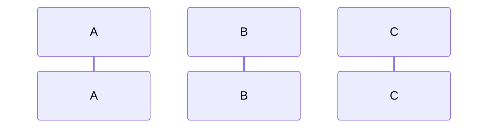

✅ **Good:**
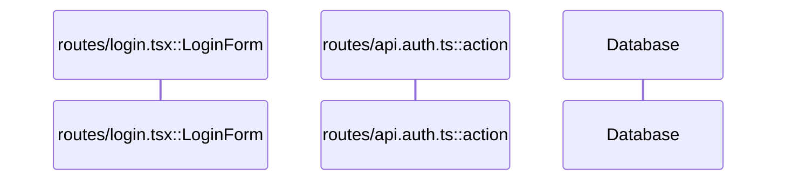

### Show Error Paths When Relevant

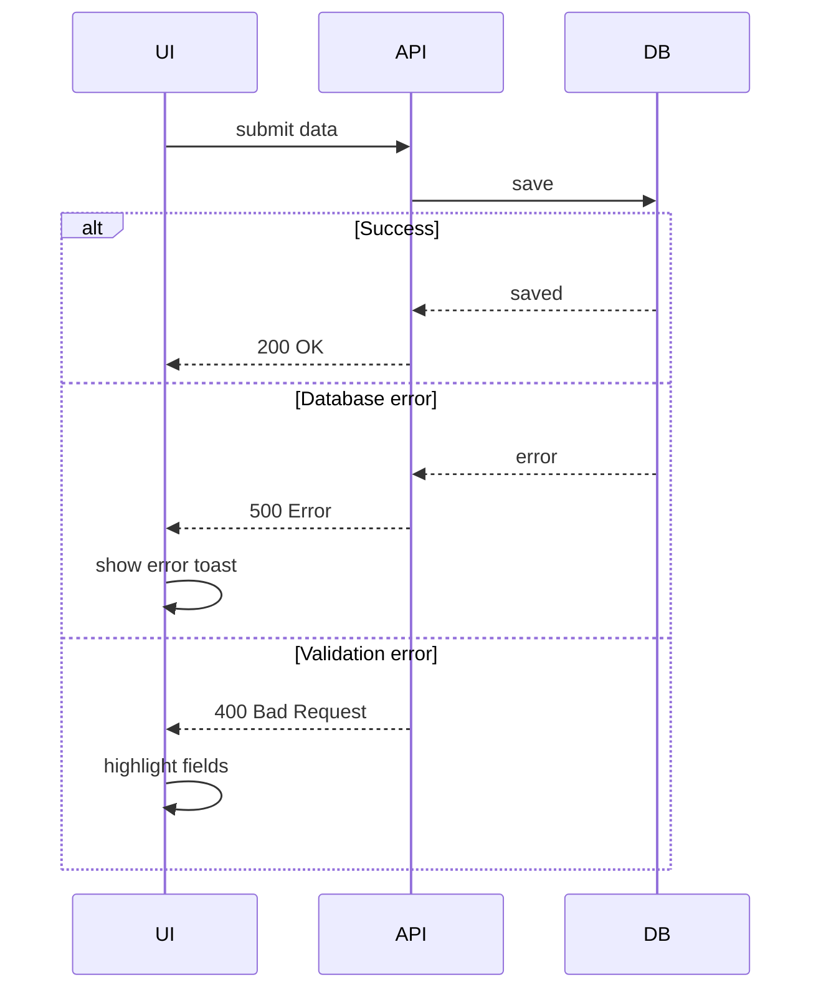

## Quick Reference: Diagram Type Selection

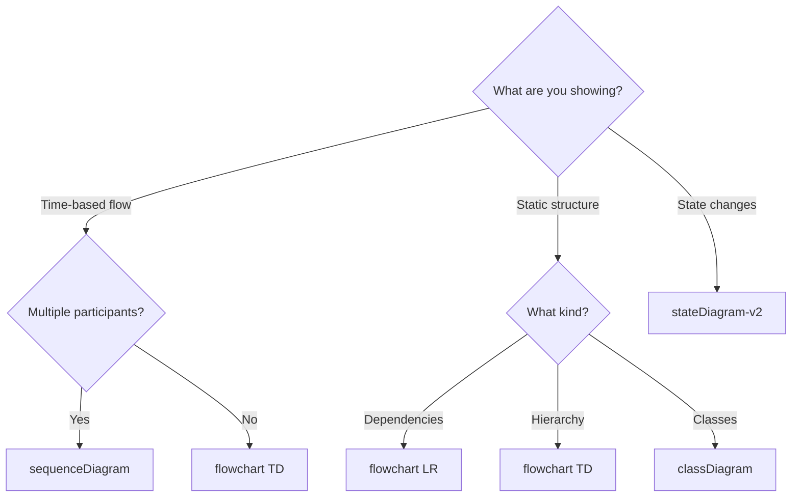
