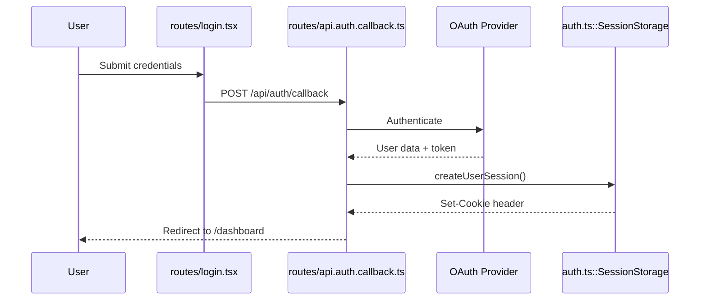
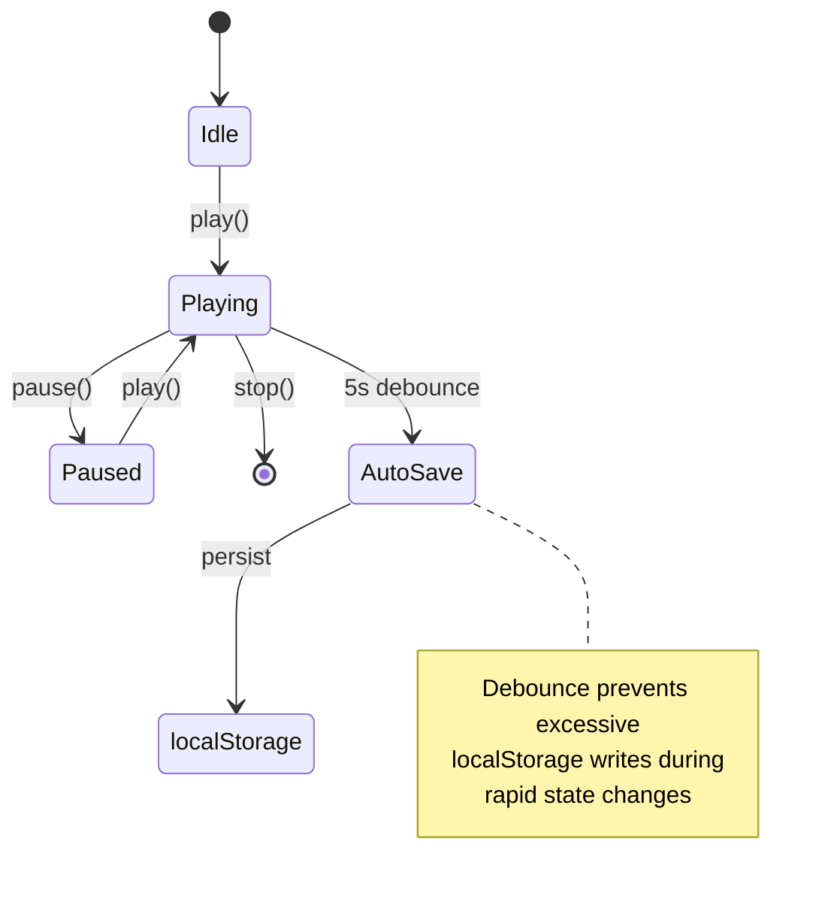

# Report Templates

Detailed examples of investigation report formats for various scenarios.

## Table of Contents
- [Simple Feature Investigation](#simple-feature-investigation)
- [Multi-File Flow Investigation](#multi-file-flow-investigation)
- [Configuration-Dependent Behavior](#configuration-dependent-behavior)
- [State Management Investigation](#state-management-investigation)

## Simple Feature Investigation

Use when investigating a single feature within 1-2 files.

### Example: Button Click Handler

```markdown
## TL;DR
The save button calls `handleSave()` which validates form data, 
then dispatches to the API endpoint with a 5-second timeout.

## Confirmed Specifications

- **Spec**: When save button is clicked, form validation runs before API call
  - **Evidence**: [components/SaveForm.tsx:L45-L48](components/SaveForm.tsx#L45-L48) - 
    `handleSave()` calls `validateForm()` and exits early if validation fails
  - **Notes**: Validation errors are displayed via toast notification

- **Spec**: API timeout is 5 seconds for save operations
  - **Evidence**: [lib/api.ts:L12](lib/api.ts#L12) - 
    `fetch` call includes `signal: AbortSignal.timeout(5000)`

## Implementation Evidence

### [components/SaveForm.tsx](components/SaveForm.tsx)
- Lines 45-48: handleSave validates form before proceeding
- Lines 52-55: Dispatches save action to API
- Lines 58-60: Error handling with toast notification

### [lib/api.ts](lib/api.ts)
- Line 12: Configures 5-second timeout for fetch requests

## Open Questions / Unknowns
None - all behavior confirmed from code.
```

## Multi-File Flow Investigation

Use when behavior spans 3+ files or involves async operations.

### Example: Authentication Flow

```markdown
## TL;DR
Login flow validates credentials via OAuth provider, stores session token 
in httpOnly cookie, then redirects to dashboard. Session expires after 24 hours.

## Confirmed Specifications

- **Spec**: When user submits login form, credentials are sent to OAuth provider (GitHub)
  - **Evidence**: [routes/api.auth.callback.ts:L23-L28](routes/api.auth.callback.ts#L23-L28) - 
    Calls `authenticator.authenticate('github')` with form data
  - **Notes**: GitHub OAuth app credentials loaded from ENV vars

- **Spec**: Successful authentication stores session token in httpOnly cookie named "session"
  - **Evidence**: [auth.ts:L15-L18](auth.ts#L15-L18) - 
    `commitSession()` sets cookie with httpOnly and secure flags
  - **Related**: [lib/cookie.ts:L8-L12](lib/cookie.ts#L8-L12) - Cookie configuration

- **Spec**: Session expires after 24 hours (86400 seconds)
  - **Evidence**: [lib/cookie.ts:L10](lib/cookie.ts#L10) - 
    `maxAge: 86400` in cookie options

## Implementation Evidence

### [routes/api.auth.callback.ts](routes/api.auth.callback.ts)
- Lines 23-28: Calls GitHub OAuth authenticator
- Lines 30-35: Creates session and commits cookie
- Lines 37-40: Redirects to dashboard on success

### [auth.ts](auth.ts)
- Lines 15-18: Session management and cookie commit
- Lines 22-25: GitHub OAuth strategy configuration

### [lib/cookie.ts](lib/cookie.ts)
- Lines 8-12: Session cookie configuration (httpOnly, secure, maxAge)

## Flow Diagram



## Open Questions / Unknowns

- **Session refresh mechanism**: Code does not show how sessions are refreshed 
  before 24-hour expiration. May require user investigation or runtime testing.
```

## Configuration-Dependent Behavior

Use when behavior depends on environment variables or config files.

### Example: Feature Flag System

```markdown
## TL;DR
Feature flags are loaded from environment variables with `FEATURE_` prefix.
Missing flags default to `false`. No runtime toggle mechanism found.

## Confirmed Specifications

- **Spec**: Feature flags are read from ENV vars matching pattern `FEATURE_*`
  - **Evidence**: [config/features.ts:L8-L12](config/features.ts#L8-L12) - 
    Filters `process.env` keys starting with "FEATURE_" and parses as boolean
  - **Notes**: Case-sensitive prefix matching

- **Spec**: Missing feature flags default to `false`
  - **Evidence**: [config/features.ts:L15](config/features.ts#L15) - 
    `Boolean(value || 'false')` coerces undefined to false

- **Spec**: Flag values must be `"true"` (string) to enable, any other value disables
  - **Evidence**: [config/features.ts:L15](config/features.ts#L15) - 
    Uses strict string comparison `value === 'true'`

## Implementation Evidence

### [config/features.ts](config/features.ts)
- Lines 8-12: Scans ENV for FEATURE_* keys
- Line 15: Parses flag values as boolean with default false
- Lines 18-22: Exports feature flag object

### Usage Example (from code)
```typescript
// In app code
if (features.FEATURE_NEW_DASHBOARD) {
  return <NewDashboard />
}
```

## Open Questions / Unknowns

- **Runtime toggle**: No mechanism found for toggling flags without server restart
  - **Next step**: Check if admin interface exists for runtime feature management
  
- **Flag validation**: No validation logic found for flag names
  - **Next step**: Determine if there's a registry of valid feature flags
```

## State Management Investigation

Use when investigating state management patterns (stores, context, reducers).

### Example: Player State Store

```markdown
## TL;DR
Player state is managed via Zustand store with persistence to localStorage.
State updates trigger React re-renders. Auto-save occurs every 5 seconds when playing.

## Confirmed Specifications

- **Spec**: Player state persists to localStorage with key "player-state"
  - **Evidence**: [stores/player.ts:L52-L56](stores/player.ts#L52-L56) - 
    Zustand `persist` middleware configured with localStorage and key "player-state"

- **Spec**: When playback state changes, auto-save triggers after 5-second debounce
  - **Evidence**: [stores/player.ts:L23-L27](stores/player.ts#L23-L27) - 
    `useEffect` with 5000ms debounce on `isPlaying` state change

- **Spec**: Volume changes save immediately without debounce
  - **Evidence**: [stores/player.ts:L32-L35](stores/player.ts#L32-L35) - 
    `setVolume` action calls persist directly without setTimeout

## Implementation Evidence

### [stores/player.ts](stores/player.ts)
- Lines 8-15: State interface definition
- Lines 23-27: Auto-save effect with 5-second debounce
- Lines 32-35: Volume setter with immediate persist
- Lines 52-56: Zustand persist middleware configuration

## Flow Diagram



## Open Questions / Unknowns

- **localStorage quota handling**: No error handling found for localStorage quota exceeded
  - **Next step**: Test behavior when localStorage is full
  
- **Hydration timing**: Unclear when persisted state is loaded on app initialization
  - **Next step**: Check app initialization sequence in entry files
```

## Notes on Report Quality

### Good Evidence Descriptions
✅ "handleSave validates form before API call (lines 45-48 show early return on validation failure)"  
✅ "Timeout set to 5 seconds via AbortSignal.timeout(5000)"  
✅ "Feature flag defaults to false when ENV var is undefined"

### Poor Evidence Descriptions
❌ "This code handles the save operation"  
❌ "The function does stuff"  
❌ "See implementation for details"

### Handling Incomplete Information
When you can't confirm something from code:

```markdown
## Open Questions / Unknowns

- **Rate limiting behavior**: Code references `rateLimiter.check()` but 
  implementation is in external package not visible in workspace
  - **Next step**: Check external package documentation or runtime logs
  
- **Retry count**: Function parameter `maxRetries` has no default value
  - **Next step**: Search for all call sites to determine common value
```
